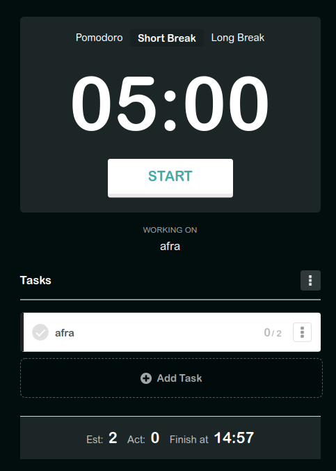

# Development Strategy

> `Pomodoro-Timer`

## Pomodoro method and creating To-do List

The aim of the project is to build an app that can create and manage a to-do list using Pomodoro method. This app is inspired by Pomodoro Technique which is a time management method developed by Francesco Cirillo. In order to achieve this, we will use HTML / CSS / JavaScript. The project will be developed by using branches and project board on GitHub.

---

## WIREFRAME

---

## 0. Set-Up

> repository owner: [Gelila](https://github.com/gelilaa)

**As a User I can see an empty site at the correct URL**

**As a fellow developer I can see the prepared repository**

### Repo

1. Generate a new repo
2. Create initial README file
3. Turn on GitHub Pages
4. Add collaborators
5. Prepare a project board

---

## 1. Development Strategy

> assigned to Fatih

**As a fellow developer or repo visitor, I want to see how the project will be developed**

### Repository

- developed on a branch called `dev-strategy`

### JS

no changes

### HTML

no changes

### CSS

no changes

### REPO

- Create `development-strategy.md`

---

## 2. HTML & CSS structure

> assigned to Gelila

**As a site visitor, I want to see the website layout and elements**

### Repository

- developed on a branch called `render-css`

### JS

no changes

### HTML

- create HTML boiler plate
- div element for each display section

### CSS

- styling of the html document and its body
- styling of the background, inner content and lists

---

## 3. User story: Manage Time

> _assigned to Fatih_

**As a site visitor, I want to start and stop pomodoro timer, short break and long break and see the remaining time**

### Repository

- developed on a branch called `timer`

### Handler

- Create timer.js

### listener

- add listeners to `start` and `stop` buttons
- add listeners to `pomodoro`, `short break`, `long break`

### logic

- Nothing has changed

### views

- create, inside `const listPrototype` object the `render` function that render the new lists

### HTML

- Nothing has changed

### CSS

- Nothing has changed

---

## 4. User story: Add Task

> _assigned to Gelila_

**As a site visitor, I want to add a task To-do List and number of pomodoros which is equivqlent to 25 minutes**

### Repository

- developed on a branch called `add`

### Handler

- Create `add` function that render the new elements of the list
- Create `add pomodoro` function that saves and renders the number of pomodoros

### listener

- Add listeners for `button` on the list

### logic

- Nothing has changed

### views

-- create the `renderList` function that render the new items of the list.

### HTML

- Nothing has changed

### CSS

- Nothing has changed

---

## 5. User story: Edit task

> _assigned to Abel_

**As a site visitor, I want to edit items on the lists**

### Repository

- developed on a branch called `edit`

### Handler

- Create the `edit` function that edits an element from the list

### listener

- Add listeners for `icon` on the list item

### logic

- Nothing has changed

### views

-- Edit the `renderList` function that render the new items of the list.

### HTML

- Nothing has changed

### CSS

- Nothing has changed

---

## 6. User story: Delete task

> _assigned to Abel_

**As a site visitor, I want to delete items on the lists that I create**

### Repository

- developed on a branch called `delete`

### Handler

- Create the `delete` function that deletes an element from the list

### listener

- Add listeners for `icon` on the list item

### logic

- Nothing has changed

### views

-- Edit the `renderList` function that render the new items of the list.

### HTML

- Nothing has changed

### CSS

- Nothing has changed

---

## 7. User story: Choose task

> _assigned to Gelila_

**As a site visitor, I want to be able to select a task to work on**

### Repository

- developed on a branch called `select`

### Handler

- Nothing has changed

### listener

- Nothing has changed

### logic

- Nothing has changed

### views

- Nothing has changed

### HTML

- Nothing has changed

### CSS

- Nothing has changed

---

## 8. User story: Status bar

> _assigned to Gelila_

**As a site visitor, I want to be able see estimated and realized number of pomodors and see the end time**

### Repository

- developed on a branch called `statusBar`

### Handler

- Nothing has changed

### listener

- Nothing has changed

### logic

- Nothing has changed

### views

- Nothing has changed

### HTML

- Nothing has changed

### CSS

- Nothing has changed

---

## 9. Finishing Touches

> assigned to \_

- W3C code validation made
- All bugs and errors were fixed
